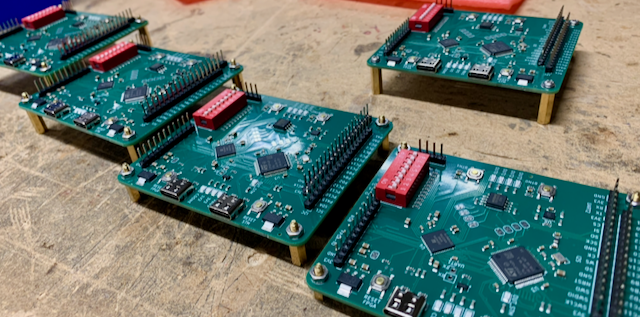
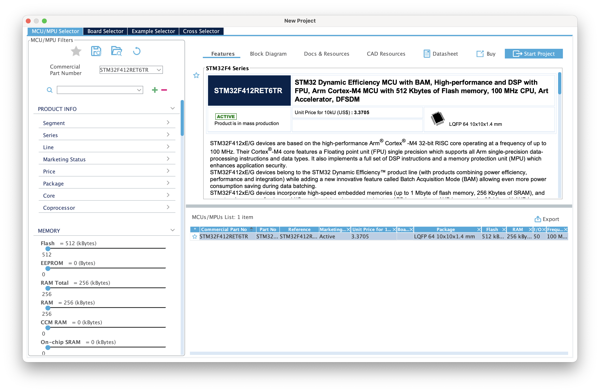
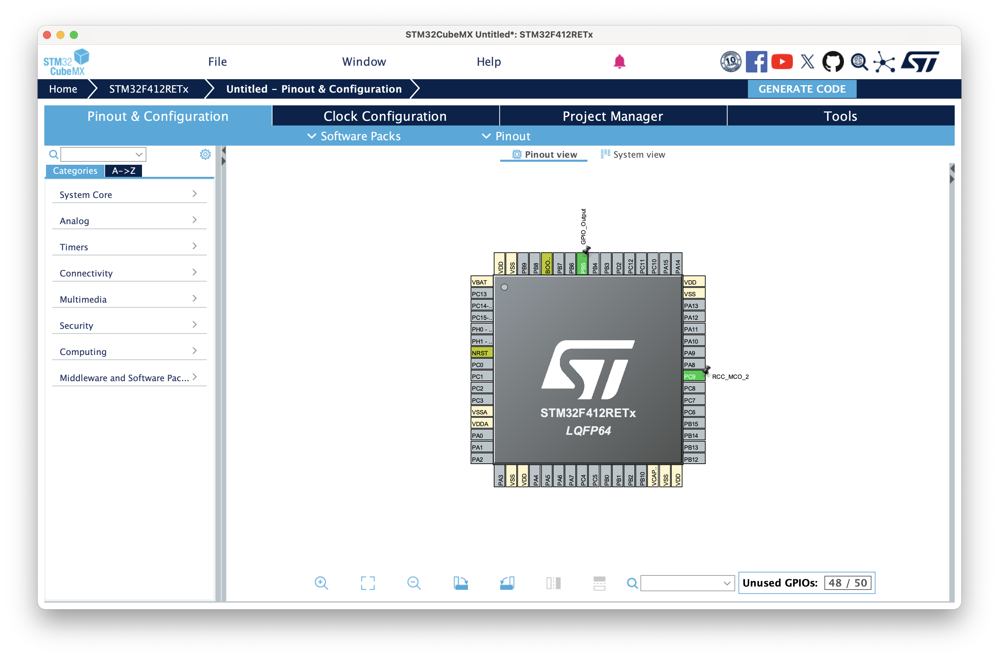
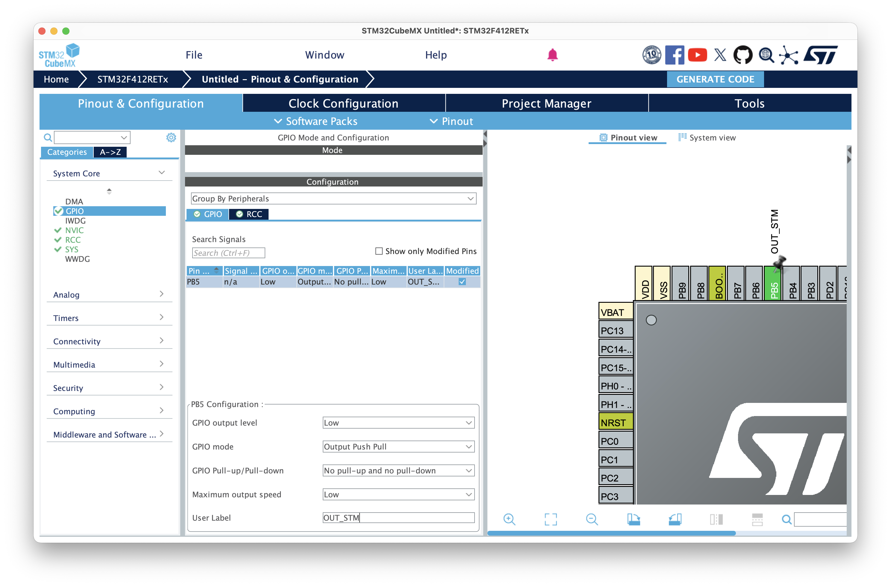
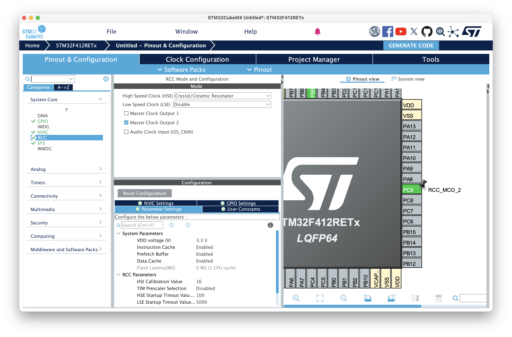
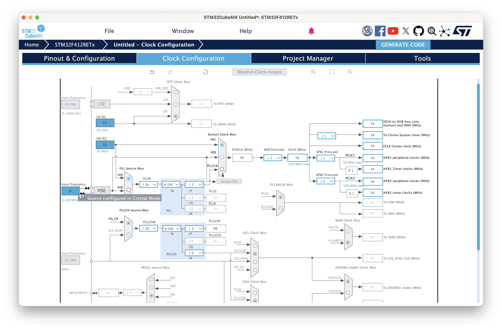
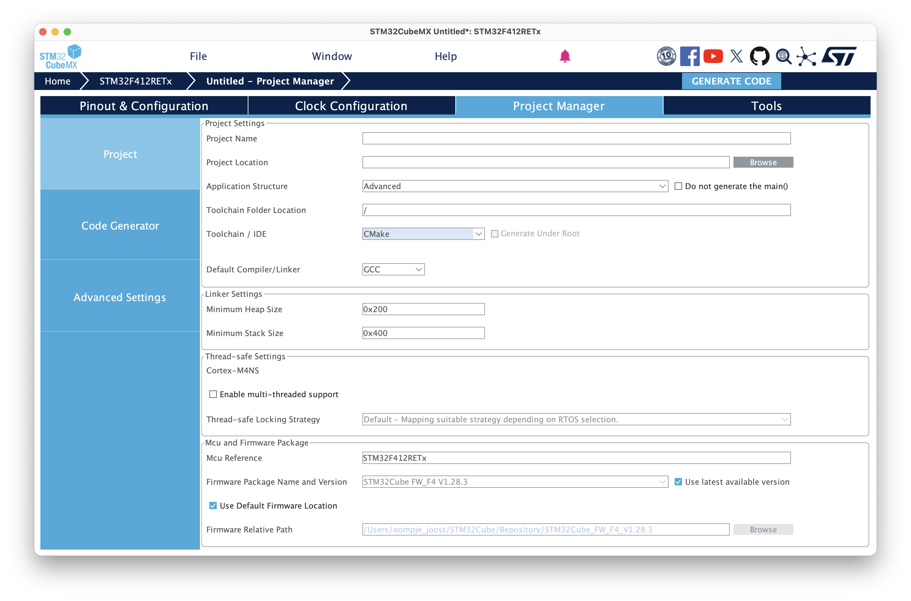
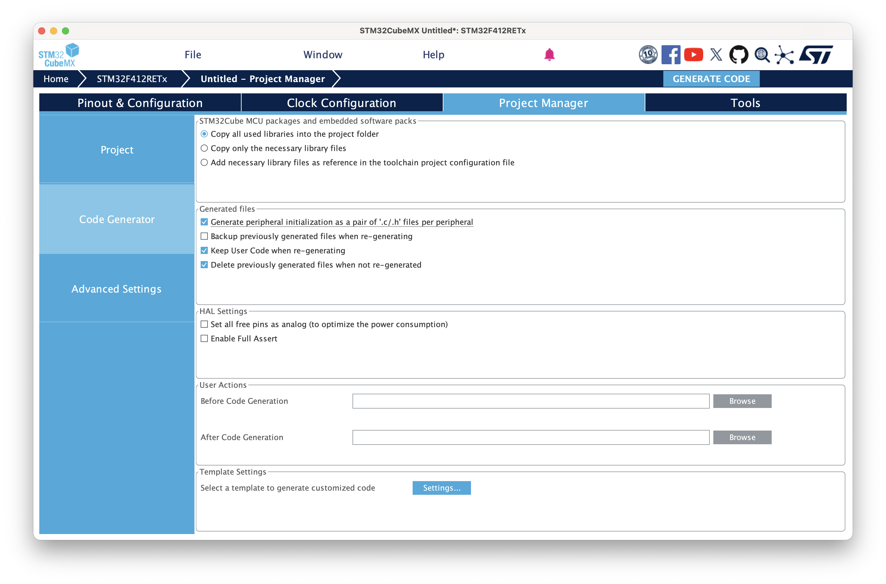
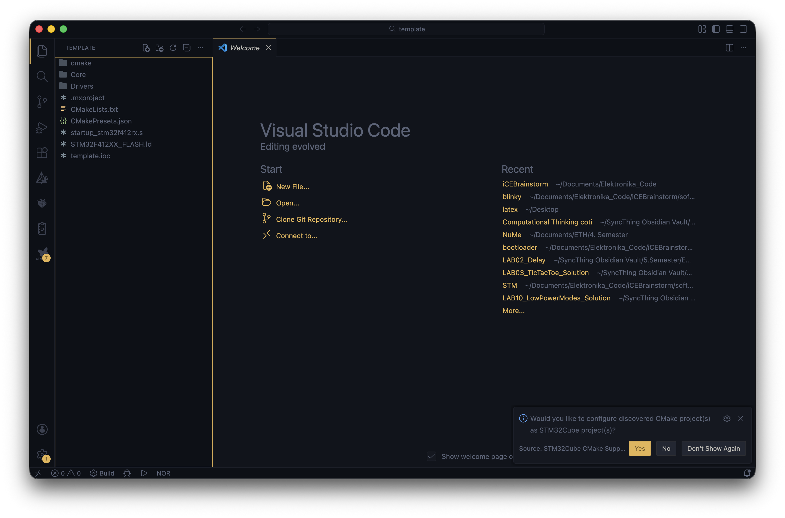
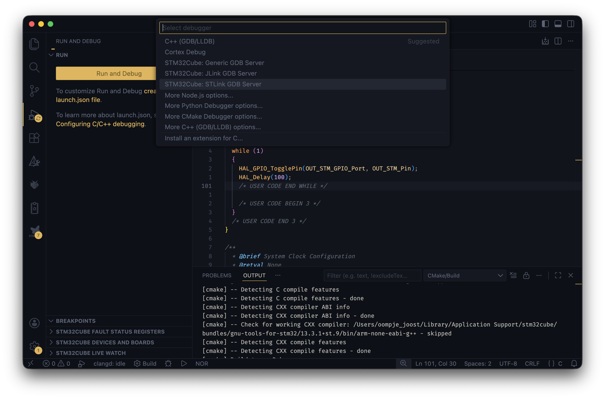

# iCEBrainstorm

A STM32F412 MCU with a iCE40UP5K FPGA on a compact dev board.



You will need STMCubeMX, VSCode with the STM32Cube Extension and STMCubeProgrammer to program the STM.

<!-- You can use [apio](https://github.com/FPGAwars/apio) to synthesise a design and upload the firmware to the FPGA using a [online dfu-uploader](https://devanlai.github.io/webdfu/dfu-util/) (easier) -->

<!-- You will need to use the [oss-cad-suite](https://github.com/YosysHQ/oss-cad-suite-build) to to synthesise your design and upload the bitstream to the FPGA.  -->
You can use apio to synthesize and upload your hdl on the FPGA. Refer to [apio support](#apio-support) on how to configure apio to support the iCEBrainstorm board.

## Basic Structure
The STM32 Microcontroller and the iCE40 FPGA share one PCB and have some connections between them to communicate.
They can be programmed through their respective USB-C Port.
There are some switches to select the "program mode" for both the STM and the FPGA.

The code and bootloader of the SMT are stored inside the SMT IC, but the code and bootloader of the FPGA are stored on an external SPI Flash IC. 

There is also an gyrosensor on board. For more documentation, go look at the KiCAD files.

<!--  -->

## How to Program:
Both the STM and the FPGA use a "Bootloader" to re-program themselfes. This makes the device visible to your computer and puts it in "program mode".


### STM32
The STM32 relies on its build-in bootloader to program itself via USB.
The bootloader is selected by switching the ```BOOT0``` Switch and ```RESET```-ing the SMT:
- Set the ```BOOT0``` Switch
- press ```RESET STM``` or plug in the cable
- The STM is now in DFU-mode, and can be programmed with STM32CubeProgrammer (or other software)
- In CubeProgrammer: select USB and click connect


- Click ```Open File``` and select your ```.elf``` file


- Click ```Download```


- Reset the ```BOOT0``` Switch.
- press ```RESET STM``` and your code should run.

### ICE40 FPGA

The FPGA relies on the [no2 bootloader](https://github.com/psychogenic/no2bootloader/tree/master), which is stored on the SPI-Flash IC.
The bootloader is selected by switching the ```FBOOT``` switch and ```RESET```-ing the FPGA, and then putting the ```FBOOT``` switch back.
Check if the ```CDONE``` LED at the top of the board is on.

- Set the ```FBOOT``` Switch
- press ```RESET FPGA``` or plug in the cable
- Reset the ```BOOT0``` Switch.
- Check if the ```CDONE``` LED at the top of the board is on.
- The FPGA is now in DFU-mode, and can be programmed with 
```apio upload``` or using ```dfu-util```

<!-- - run ```dfu-util -l``` to list all dfu devices. -->
<!-- example output: 
```Found DFU: [1d50:6146] ver=0006, devnum=12, cfg=1, intf=0, path="", alt=1, name="RISC-V firmware", serial="e464bc68932e5839"
Found DFU: [1d50:6146] ver=0006, devnum=12, cfg=1, intf=0, path="", alt=0, name="iCE40 bitstream", serial="e464bc68932e5839"
``` -->
<!-- - run ```dfu-util -d 1d50:6146 -a 0 -D hardware.bin``` to flash your bitstream on the FPGA. Maybe You have to replace the ```1d50:6146```-number with what you see on your terminal. -->
- you can run ```apio devices usb``` to list all dfu devices and verify that everything works.
- run ```apio upload``` to synthesize and upload the verilog code.

-  To edit your HDL code, take a look at the examples in [software/FPGA](./software/FPGA)

### APIO Support
[apio](https://github.com/FPGAwars/apio) is a open-source FPGA Toolchain, which will help us synthesize HDL code.
Make sure you have a recent version of apio installed! You can uninstall and install again to update.
- Install apio using ```pip install apio```
- edit ```~/.apio/packages/definitions/boards.jsonc``` and add this snippet:
```
  // https://github.com/jdekanter077/iCEBrainstorm
  "iCEBrainstorm": {
    "legacy-name": "iCEBrainstorm",
    "description": "iCEBrainstorm by jdk",
    "fpga-id": "ice40up5k-sg48",
    "programmer": {
      "id": "dfu"
    },
    "usb": {
      "vid": "1d50",
      "pid": "6146"
    }
  },
```

This will add apio support for the iCEBrainstorm board.
-  to create a new project, run ```apio create -b iCEBrainstorm```
-  edit your HDL code, take a look at the examples in [software/FPGA](./software/FPGA)

### Bootloader
The Bootloader is preinstalled by Joël and should not have to be touched.
Check out [bootloader/README.md](./software/FPGA/bootloader/README.md) for more information.

## Setting up a blank Project
### STM
- Open CubeMX and select ```File -> New Project```.
- In ```Commercial Part Number```, Type ```STM32F412RET6TR``` and select ```Start Project```.

- Select ```RCC_MCO_2``` on ```PB9``` to provide a Clock signal to the FPGA
- Select your desired pins, for example ```PB5```, which is connected to the on-board LED and select ```GPIO_Output```.

- On the left Pane in ```System Core -> GPIO -> PB5``` set a user label, for example ```OUT_STM```

- Set the Input Clock to Cyrstal Oscillator in ```System Core -> RCC```

- Got to ```Clock Configuration``` at the top and set the Input Frequency of the Clock to 16 MHz

- Go to ```Project Manager``` on the top.
Make sure to select ```CMake``` as the ```Toolchain / IDE```.

Make sure to set ```Generate ... as pair of '.c/.h' files ...```


- Save your project and click ```GENRATE CODE``` in the top right and open the folder in VSCode

- Make sure to not miss the notification to "configure CMake Projects as STM32 Projects". click Yes.


- Select a Preset from the Popup (Debug)
- Edit the Code, for example, add blinky loop in ```Core/Src/main.c```
- ```line 98```:

```
/* USER CODE BEGIN WHILE */
while (1)
  {
    HAL_GPIO_TogglePin(OUT_STM_GPIO_Port, OUT_STM_Pin);
    HAL_Delay(100);
    /* USER CODE END WHILE */

    /* USER CODE BEGIN 3 */
  }
  /* USER CODE END 3 */
}
```
- To Compile the code, go to ```Run & Debug -> Run & Debug -> STM32Cube: STLink GDB Server```


- This will compile the code, and try to start a "debugger", which is not available and gives a error. The Code should still be compiled correctly!
- Check if you have a ```.elf``` file in ```build/Debug/```. Upload this to the iCEBrainstorm using the steps described in [how-to-programm](#how-to-program)

## Clock
The STM and the FPGA are relatively independent from each other, with one slight caveat:
The STM32 is responsible for providing the FPGA with a Clock signal. The no2-bootloader of the FPGA relies on this clock source, and will not work without it. 

This clock can of course be used in your FPGA design as well.

### How to provide the clock 
- In cubeMX, go to ```PC9``` and select ```RCC_MCO_2```


- Generate Code, open the folder in STMCubeIDE or VSCode, compile, and upload using STMCubeProgrammer.
- Done!

## FPGA Pinout Description:
These informations should be in every ```main.pcf``` file.

| Description | FPGA Pin | Usage |
| --- | ---- | ---- |
| clk_i | 20  | 16 MHz Clock, provided by the STM32 | 
| btn_0 | 31 | left button | 
| btn_1 | 32 | right button | 
| in_0 | 34 | Input Switch and/or GPIO | 
| in_1 | 35 | Input Switch and/or GPIO | 
| in_2 | 36 | Input Switch and/or GPIO | 
| in_3 | 37 | Input Switch and/or GPIO | 
| out_0 | 25  | LED | 
| out_1 | 26  | LED | 
| out_2 | 27  | LED | 
| out_3 | 28  | LED | 
| io_0 | 47  | GPIO | 
| io_1 | 42  | GPIO | 
| io_2 | 38  | GPIO | 
| io_3 | 23  | GPIO | 
| rgb_0 | 39 | RGB LED and/or GPIO | 
| rgb_1 | 40 | RGB LED and/or GPIO | 
| rgb_2 | 41 | RGB LED and/or GPIO | 
| uart_tx | 2  | uart output (STM RX <- FPGA TX) | 
| uart_rx | 3  | uart input (STM TX -> FPGA RX) | 
| scl | 19 | I2C Clock | 
| sda | 18 | I2C Data | 

# Examples

## FPGA & STM: Morse Encoder
This project implements Morse encoder. The FPGA encodes the Morse Code, and sends the encoded character over UART to the STM.
The STM then sends the recieved character over USB to the host machine.

- upload ```./software/STM/uart_serial_bridge``` to the STM.
- upload ```./software/FPGA/morse_uart``` to the FPGA.
- open a serial monitor and have fun!

for details: take a look at the [Readme](./software/FPGA/morse_uart/README.md)

## STM: uart-serial Bridge

This project implements a UART-Serial bridge. The STM sends all recieved uart messages over usb to the host machine, and sends all recieved usb messages over usb to the FPGA.
This is done by using an Interrupt-driven approach.

snippet:

## FPGA: bram
[bram](./software/FPGA/bram)

This example of how to instintiate a one of the build-in BRAMs on the FPGA is based on [this repo](https://github.com/damdoy/ice40_ultraplus_examples/tree/master/bram) and on the [online documentation](https://www.latticesemi.com/~/media/LatticeSemi/Documents/ApplicationNotes/MO/MemoryUsageGuideforiCE40Devices.pdf)
It uses the switches IN0-IN3 as input "data" and loads it into the bram using btn0. Using btn1, the "data" can then be displayed on the leds.

# Author
Joël de Kanter

# License

This repository is primarily licensed under the GNU General Public License v3.0.

Exceptions:
- STM32CubeMX-generated files are licensed under STMicroelectronics'
  STM32Cube firmware license (see file headers).
- The NO2 bootloader firmware is licensed under GPL-3.0-or-later
- Some third-party components may be licensed under MIT or CERN OHL v2.
